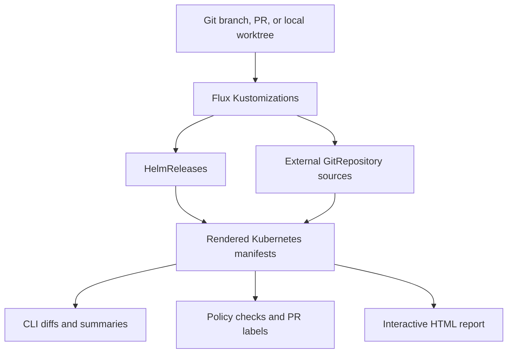
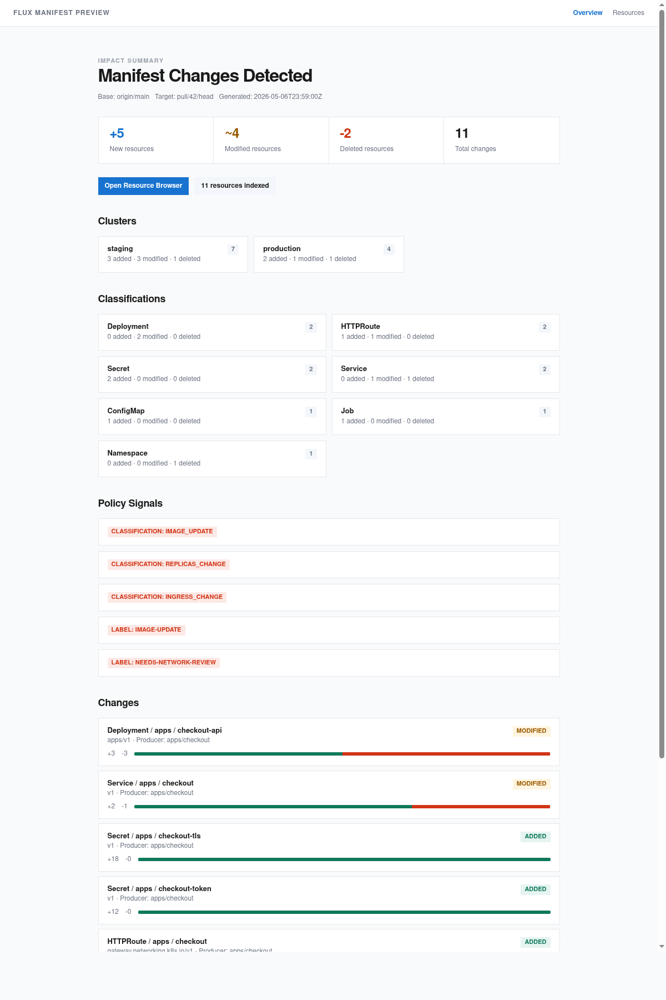
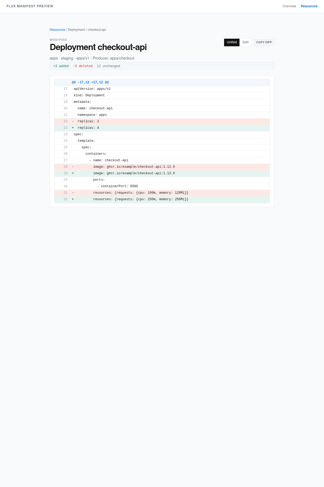
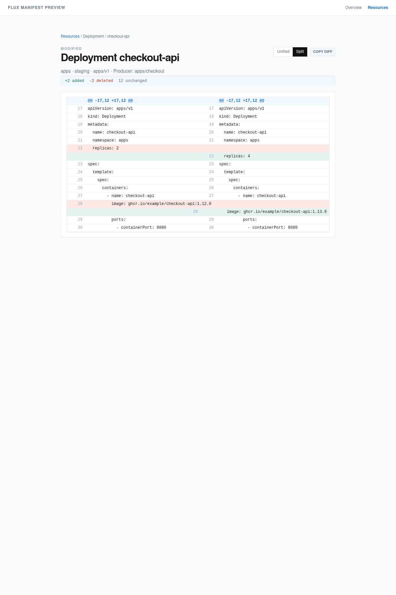

# Flux Manifest Preview (`fmp`)

[](https://github.com/tobiash/flux-manifest-preview/actions/workflows/ci.yml)
[](https://github.com/tobiash/flux-manifest-preview/releases/latest)
[](https://goreportcard.com/report/github.com/tobiash/flux-manifest-preview)
[](https://github.com/tobiash/flux-manifest-preview/blob/main/LICENSE)

**Preview rendered Kubernetes resource changes before a GitOps change reaches the cluster.**

`fmp` renders supported Flux, Helm, and Kustomize inputs, compares two revisions, and turns the result into CLI diffs, structured JSON, PR comments, policy checks, and an interactive HTML report. It is a local preview, not a complete implementation of Flux controller reconciliation or Kubernetes admission.

It is built for Kubernetes platform teams reviewing Flux pull requests where the source YAML is not the whole story: `Kustomization` dependencies, `HelmRelease` rendering, external `GitRepository` sources, generated metadata, and multi-cluster layouts all affect the final manifests.

> [!NOTE]
> `fmp` is under active development. It is already useful for local review and CI validation, but workflows and report details may continue to evolve.

---

## What it shows you

Instead of asking “what YAML changed?”, `fmp` answers “what Kubernetes resources will change after Flux renders this repo?”



Use it to catch risky changes before merge:

- image updates and replica changes hidden inside Helm values
- Ingress/Gateway/HTTPRoute or Service exposure changes
- Secret, CRD, PVC, StatefulSet, DaemonSet, and Namespace changes
- noisy generated fields that would otherwise create permanent diffs
- cluster-specific impact in multi-cluster Flux repositories

---

## HTML report preview

Enable `html-report` in the GitHub Action to generate a browsable report artifact, or deploy it to GitHub Pages for direct links from pull requests.

| Impact overview                                                                                     | Unified resource diff                                                                                    | Side-by-side diff                                                                                                       |
| --------------------------------------------------------------------------------------------------- | -------------------------------------------------------------------------------------------------------- | ----------------------------------------------------------------------------------------------------------------------- |
| [](docs/assets/fmp-report-overview.png) | [](docs/assets/fmp-report-unified-diff.png) | [](docs/assets/fmp-report-side-by-side-diff.png) |

View the [sample HTML report in a browser](https://raw.githack.com/tobiash/flux-manifest-preview/main/docs/examples/fmp-report-example.html), or download the checked-in [single-file HTML report](docs/examples/fmp-report-example.html) to open it locally.

The report includes:

- long-form impact summary
- added / modified / deleted resource counts
- multi-cluster breakdowns
- resource browser with search and filters for kind, namespace, cluster, producer, and action
- unified and side-by-side per-resource diffs
- policy classifications and violations when configured

---

## Key features

- **Flux-aware rendering** — discovers `Kustomization.spec.path`, follows Flux dependency patterns, and can resolve external `GitRepository` sources.
- **HelmRelease support** — renders `HelmRelease` resources through the Helm SDK, including post-renderers and `commonMetadata`.
- **Git-aware diffs** — compare `HEAD`, branches, commits, local paths, or your dirty worktree.
- **Multi-cluster reports** — configure several cluster roots and review each cluster independently.
- **SOPS support** — decrypt encrypted resources locally when requested.
- **Noise reduction** — normalize generated fields such as timestamps, random hashes, or certificate data.
- **Policy checks** — classify changes, block risky PRs, and suggest/apply labels using built-in or custom Rego policies.
- **AI assessment** — optionally generate a concise review summary and provenance-aware classifications with OpenAI, Anthropic, Z.AI, MiniMax, or OpenRouter.
- **Agent-friendly output** — render, diff, test, and discovery commands support structured JSON, with failure diagnostics kept in a single document.

---

## Install

### From source

```bash
go install ./cmd/fmp
```

### Latest release via Go

```bash
go install github.com/tobiash/flux-manifest-preview/cmd/fmp@latest
```

### Requirements

- `git` for git-aware diffing and external repository resolution
- `helm` for Helm chart registry/cache behavior while rendering `HelmRelease` resources

---

## Quick start

Run this inside a Flux repository:

```bash
fmp diff
```

By default, this compares rendered manifests from `HEAD` with your current worktree, so you can review the cluster impact of uncommitted local changes.

Configure `paths` or cluster roots in `.fmp.yaml`, or supply `-k/--path` (for example, `fmp diff -k clusters/production`). A repository argument selects the source directory; it does not implicitly select `.` as a render root. Missing render roots are an error.

Common examples:

```bash
fmp diff                      # HEAD vs current worktree
fmp diff HEAD~1               # one commit back vs current worktree
fmp diff main feature-branch  # two git refs
fmp diff ./before ./after     # two local directories
fmp diff git:HEAD path:/tmp   # mix git refs and local paths
```

Render manifests directly:

```bash
fmp render <path>
fmp render --output json <path>
```

Discover and validate Flux resources:

```bash
fmp test <path>       # validate renderability
fmp get ks <path>     # list discovered Kustomizations
fmp get hr <path>     # list discovered HelmReleases
```

Automation helpers:

```bash
fmp ci                        # CI-optimized diff mode
fmp detect-permadiffs <path>  # suggest filters for noisy fields
```

---

## Configuration

`fmp` auto-discovers `.fmp.yaml`, `.fmp.yml`, or `.github/fmp.yaml`.

Minimal config:

```yaml
paths:
  - clusters/kube
recursive: true
helm: true
resolve-git: true
sort: true
exclude-crds: true
```

Multi-cluster repositories can use `cluster:path` entries:

```yaml
paths:
  - staging:clusters/staging/flux-system
  - production:clusters/production/flux-system
```

Or the `clusters` map:

```yaml
clusters:
  staging:
    - clusters/staging/flux-system
  production:
    - clusters/production/flux-system
```

Add field normalizers and policy rules when you want deterministic diffs and automated review gates:

```yaml
paths:
  - staging:clusters/staging/flux-system
  - production:clusters/production/flux-system
recursive: true
helm: true
resolve-git: true
sort: true

filters:
  - kind: FieldNormalizer
    match:
      kind: Secret
    fieldPaths:
      - path: [data, tls.crt]
        action: replace
        placeholder: "<<auto-generated>>"

policies:
  builtin:
    - image_update
    - ingress_change
    - secret_change
  fail-on:
    - forbid_latest
  labels:
    image_update: image-update
    ingress_change:
      - needs-network-review
      - risky-change
  inline:
    - |
      package fmp
      import rego.v1

      violations contains {
        "id": "forbid_latest",
        "message": sprintf("%s/%s uses :latest", [change.namespace, change.name]),
        "severity": "error"
      } if {
        some change in input.changes
        spec := object.get(change.new, "spec", {})
        template := object.get(spec, "template", {})
        podspec := object.get(template, "spec", {})
        some c in object.get(podspec, "containers", [])
        endswith(object.get(c, "image", ""), ":latest")
      }
```

In `diff` mode, configuration is loaded from the current worktree so local config changes take effect immediately.

### Built-in policy IDs

Built-in policies currently include:

- `image_update`
- `secret_change`
- `ingress_change`
- `crd_change`
- `namespace_delete`
- `stateful_workload_change`
- `pvc_change`
- `service_type_change`
- `replicas_change`

`fail-on` matches policy IDs. If any listed rule matches, `fmp diff` exits non-zero and the GitHub Action fails. `labels` maps policy IDs to one or more pull request labels.

### AI assessment

AI assessment is an optional generated review aid for `fmp diff` and the GitHub Action. It adds a concise generated summary and may add classifications with `provenance: ai`; policy classifications use `provenance: policy`.

Enable it in config:

```yaml
ai:
  enabled: true
  provider: openai # openai, anthropic, zai, minimax, or openrouter; optional if exactly one token is set
  model: gpt-4o-mini # optional provider-specific override
  fail-on-error: false
  allowed-classifications:
    - network_exposure
    - data_risk
  max-input-bytes: 100000
  max-diff-lines-per-resource: 80
  timeout: 30s
  instructions: |
    Focus on production-impacting Kubernetes changes.
```

Or enable per invocation:

```bash
OPENAI_API_KEY=... fmp diff --ai-assessment --summary
```

Supported credential environment variables are `OPENAI_API_KEY`, `ANTHROPIC_API_KEY`, `ZAI_API_KEY`, `MINIMAX_API_KEY`, and `OPENROUTER_API_KEY`. If no provider is configured, `fmp` auto-selects only when exactly one supported token is present; missing or ambiguous credentials warn and skip AI assessment by default.

AI classifications participate in the same `policies.labels` and `policies.fail-on` mappings as policy classifications. Use `ai.allowed-classifications` when you want to restrict which generated classification IDs may enter the unified classification set.

---

## GitHub Action

Use the action to review Flux pull requests automatically.

```yaml
- uses: actions/checkout@v6
  with:
    fetch-depth: 0 # required for git-aware diffing

- uses: tobiash/flux-manifest-preview@vX.Y.Z
  with:
    repo: .
    base-ref: origin/main
    resolve-git: true
    comment: true
    html-report: true
    ai-assessment: true
  env:
    OPENAI_API_KEY: ${{ secrets.OPENAI_API_KEY }}
```

### Rich HTML report artifact

```yaml
- uses: tobiash/flux-manifest-preview@vX.Y.Z
  with:
    repo: .
    base-ref: origin/main
    html-report: true
```

The action uploads the report as an artifact and exposes:

- `html-report-file` — generated `index.html`
- `html-report-artifact` — uploaded artifact name
- `html-report-url` — direct report URL when available

### Deploy report to GitHub Pages

```yaml
- uses: tobiash/flux-manifest-preview@vX.Y.Z
  with:
    repo: .
    base-ref: origin/main
    html-report: true
    html-report-pages: true
```

This publishes reports to the `gh-pages` branch. When Pages is not enabled, the report is still available as a downloadable single-file HTML artifact that GitHub can preview directly.

### Export rendered manifests

The action's `export-dir` and `export-changed-only` inputs are reserved; manifest export is not implemented yet. Use `fmp render` for direct manifest output instead.

### Important inputs

| Input                 | Description                                        | Default         |
| :-------------------- | :------------------------------------------------- | :-------------- |
| `repo`                | Path to the repository checkout                    | `.`             |
| `base-ref`            | Git ref to diff against                            | `origin/main`   |
| `base-sha`            | Exact SHA to diff against; overrides `base-ref`    |                 |
| `paths`               | Directories to render, newline-separated           |                 |
| `recursive`           | Recursively discover paths                         | `false`         |
| `helm`                | Enable Helm rendering                              | `true`          |
| `resolve-git`         | Clone external `GitRepository` sources             | `false`         |
| `sort`                | Sort output for deterministic diffs                | `false`         |
| `exclude-crds`        | Strip CRDs from output                             | `false`         |
| `config`              | Explicit config path                               | auto-discovered |
| `comment`             | Post/update a sticky PR comment                    | `false`         |
| `comment-mode`        | When to comment: `changes`, `always`, or `failure` | `changes`       |
| `html-report`         | Generate and upload the HTML report                | `false`         |
| `html-report-pages`   | Deploy the HTML report to GitHub Pages             | `false`         |
| `ai-assessment`       | Enable AI assessment; empty inherits config        |                 |
| `ai-provider`         | AI provider override                               |                 |
| `ai-model`            | AI model override                                  |                 |
| `ai-fail-on-error`    | Fail if AI assessment cannot be generated          |                 |
| `export-dir`          | Reserved; manifest export is not implemented       |                 |
| `export-changed-only` | Reserved; manifest export is not implemented       | `false`         |
| `fail-on-warning`     | Fail the step on warnings                          | `false`         |
| `fail-on-error`       | Fail the step on errors                            | `true`          |

### Important outputs

| Output                                                         | Description                                               |
| :------------------------------------------------------------- | :-------------------------------------------------------- |
| `status`                                                       | Overall status: `clean`, `changed`, `warning`, or `error` |
| `changed`                                                      | Whether manifest changes were detected                    |
| `resources-added` / `resources-modified` / `resources-deleted` | Change counts                                             |
| `resources-total`                                              | Total changed resources                                   |
| `diff-file`                                                    | Unified diff preview file; may be truncated                |
| `summary-file`                                                 | Markdown summary file                                     |
| `report-file`                                                  | Structured JSON report                                    |
| `html-report-url`                                              | Direct URL to the interactive HTML report when available  |
| `export-dir`                                                   | Requested export directory; does not confirm an export    |
| `classifications-json`                                         | Matched classifications with provenance                    |
| `violations-json`                                              | Matched policy violations                                 |
| `labels-json`                                                  | Suggested or applied PR labels                            |
| `policy-failed`                                                | Whether a configured `fail-on` policy matched             |
| `ai-assessment-json`                                           | AI assessment object when generated                       |
| `ai-summary`                                                   | AI-generated summary when generated                       |

> [!WARNING]
> `sops-decrypt` is intentionally unsupported in the GitHub Action to avoid leaking decrypted content into logs, summaries, comments, or artifacts.

---

## Structured output and exit codes

`render`, `diff`, `test`, and `get ks/hr` support `--output json`:

```bash
fmp diff --output json
fmp render --output json <path>
fmp test --output json <path>
fmp get ks --output json <path>
fmp get hr --output json <path>
```

JSON output preserves the existing command-specific shapes:

- rendered resources are wrapped in a `v1/List` envelope; discovery commands use an `items` collection
- resource references use `ObjectRef` fields: `apiVersion`, `kind`, `name`, `namespace`
- errors include `{"status":"failure","error":{"reason":"...","message":"..."}}` in the same document as any available result, never as a second JSON document
- diff results include `complete`, `warnings`, and a unified `changes` array carrying action, cluster, structured provenance, before/after origins, and resource snapshots
- legacy `added`, `deleted`, and `modified` fields remain available; use `changes` to retain cluster and provenance context for every action
- empty change collections are `[]`, not `null`

Ordinary complete diffs continue to exit 0 even when resources change. Use `fmp diff --exit-code` to exit 1 for differences. A failed policy or execution still returns nonzero without this flag. With JSON output, a failed check retains the available diff and its `complete: true` field alongside failure information.

| Code | Meaning                                                 |
| ---- | ------------------------------------------------------- |
| 0    | Success; may include differences unless `--exit-code` is set |
| 1    | Differences with `--exit-code`, or an otherwise unclassified error |
| 2    | Explicitly classified user input error                  |
| 3    | Expansion failure or explicitly classified dependency failure |
| 5    | Policy violation                                        |

Not every validation or dependency error is classified separately yet. Treat any nonzero status as a failed command/check and inspect the JSON error or stderr for details.

### Incomplete previews

If either side fails to render, fmp suppresses the entire comparison rather than reporting missing resources as deletions or an empty diff as clean. Policy and AI assessments are skipped, and the CLI/action fails. JSON failures include `complete: false`; action reports carry error status and diagnostics even when advisory `fail-on-error` behavior is disabled.

Malformed manifests, duplicate output identities, failed source acquisition, unresolved sources at the discovery fixed point, and missing discovered paths are failures. Known fmp configuration files are not treated as raw manifests. Distinct Flux rendering contexts remain separate even when they use the same directory, while equivalent bootstrap paths are deduplicated.

Completeness covers the configured render scope and detected failures. It does not guarantee full Flux feature parity, live-cluster validity, or runtime behavior. Rendering may access remote sources, credentials, or external programs according to your configuration; it is not sandboxed.

The hidden `describe` command emits command and flag metadata for agents and other automation:

```bash
fmp describe
```

---

## Local pre-commit policy check

Example [lefthook](https://github.com/evilmartians/lefthook) hook that checks only staged changes:

```yaml
pre-commit:
  commands:
    fmp-policy:
      run: |
        if [ ! -f .fmp.yaml ] || ! grep -q "policies:" .fmp.yaml; then
          exit 0
        fi
        if ! command -v fmp >/dev/null 2>&1; then
          echo "warning: fmp not found in PATH, skipping policy check" >&2
          exit 0
        fi
        head_tree=$(git rev-parse HEAD^{tree})
        staged_tree=$(git write-tree)
        fmp diff "git:${head_tree}" "git:${staged_tree}" --summary-only
```

---

## Development

```bash
go test ./...
go vet ./...
```

For local action development or branch testing, build `fmp` ahead of time and pass it to the action with the `binary` input.
